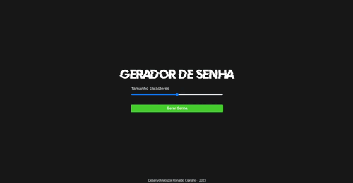

# Gerador de Senha Simples

Um gerador de senha simples desenvolvido em HTML, CSS e JavaScript. Através do ensino de [GitHub - devfraga](https://github.com/devfraga).

[youtube](https://www.youtube.com/watch?v=i6t2jaRxos4)

## Funcionalidades

- Geração de senhas aleatórias com comprimento personalizável.
- Copiar a senha gerada para a área de transferência.

## Como Usar

1. Faça o download ou clone este repositório.
2. Abra o arquivo `index.html` em um navegador web.
3. Deslize o controle deslizante para definir o comprimento da senha.
4. Clique no botão "Gerar Senha" para gerar uma senha aleatória.
5. Clique na senha gerada para copiá-la para a área de transferência.

## Autor

[GitHub - ronaldocipriiano](https://github.com/ronaldocipriiano/)

## Licença
Este projeto está licenciado sob a Licença MIT - veja o arquivo LICENSE para mais detalhes.

